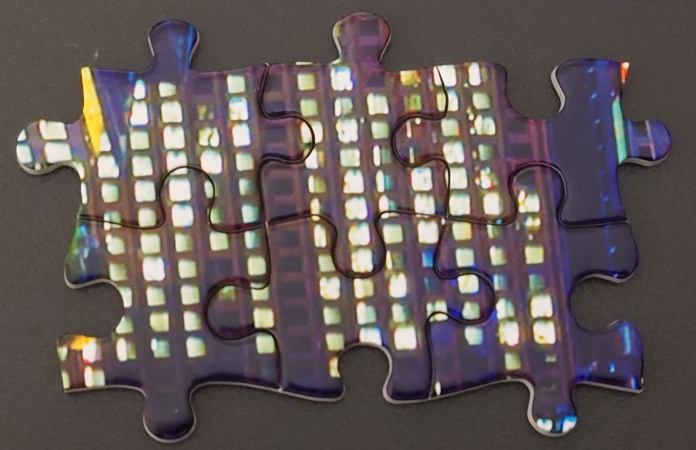
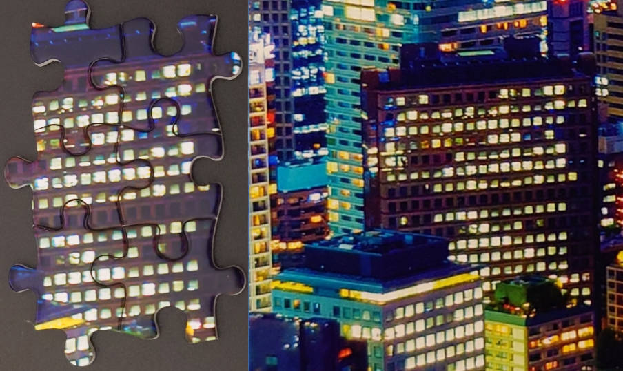

# Find the answer of the puzzle
## Step 1: upload and define the main image
First of all, combine all the parts of the puzzle pictures.
You can take the picture separately and combine them together.

The important thing is that the features of the picture should be clear.


## Step 2: upload the sub image


## Step 3: run the code
```bash
python AKAZE_method.py main_image_path, sub_image_path, save_folder, 0.78
```
You will get the mapping result in the save_folder.


### Really mapping angle
Its seems clearly than original image.


